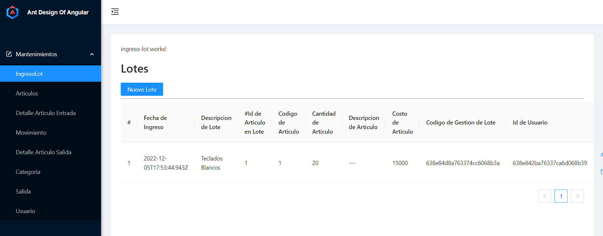
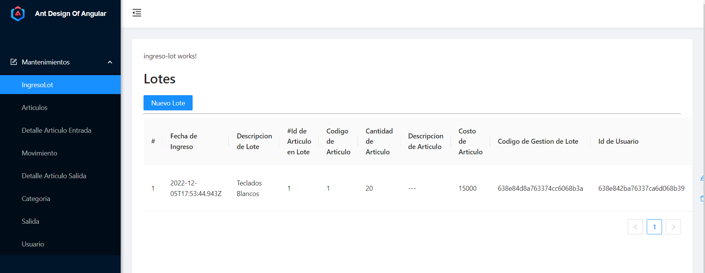

# Proyecto Inventario

## Integrantes del Grupo 1

- Daniel Eduardo Morales Flores 61521332
- Salvador Alejandro Chinchilla Alvarado 21741179
- Shadia Corra Nassar 61811173
- Sergio Daniel Barahona Menjivar 61351186

## Introduccion
En el siguiente repositorio se logra publicar el trabajo realizad en front-end para el desarrollo de la pagina web del gestor de Inventario creado como proyecto final de la clase de programacion IV.

## Herramientas Utilizadas
- Angular
- Typescript
- Github Pages

## Imagenes
Pagina Inicial

Pagina principal de Manejo de Lotes de Inventario

## Enlaces

[Enlace en Github Pages](https://srgio29.github.io/PrograIVProyectoInventario/#/)  